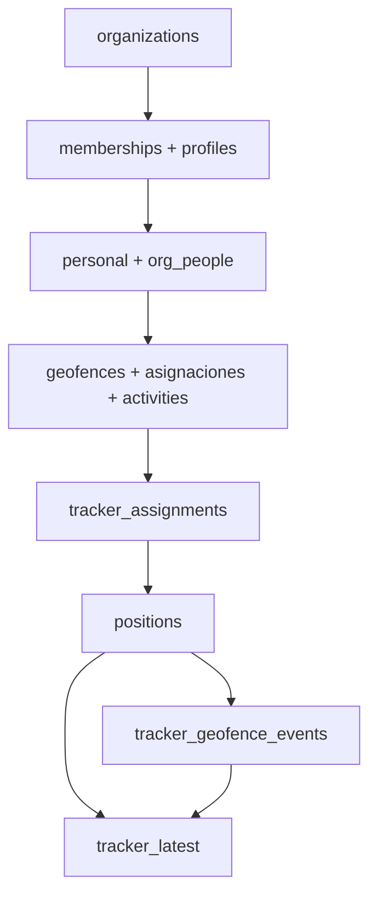
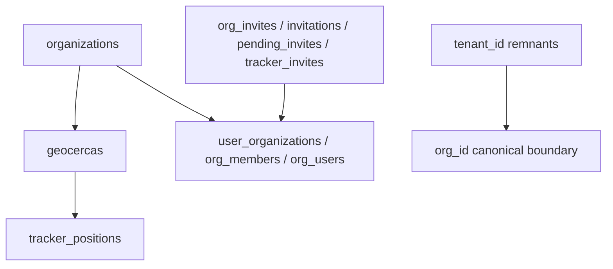

# DATA FLOW

## 1. Purpose

This document describes the main data movement pipelines of **App Geocercas** using the documented database model.

It explicitly separates:

- confirmed documented flow
- inferred logical flow
- legacy / transitional flow

The focus is operational data movement across domains, not only table listing.

---

## 2. Source of Truth and Scope

Primary source of truth:

- `docs/DB_SCHEMA_MAP.md`

Supporting context (used only when non-conflicting):

- `docs/DB_OVERVIEW.md`
- `docs/TRACKER_SYSTEM.md`
- `docs/FLUJOS_CLAVE.md`
- `docs/TABLE_RELATION_DIAGRAM.md`

Scope rules applied in this document:

- only documented schema objects are used
- undocumented runtime details are never presented as confirmed facts
- inferred behavior is explicitly labeled as inferred

---

## 3. Core Domains Participating in Data Flow

Operational domains involved in data movement:

- **Organizations and memberships**: `organizations`, `memberships`
- **Profiles / users**: `profiles`
- **Operational identity**: `personal`, `org_people`
- **Territorial model**: `geofences` (canonical), `geocercas` (legacy coexistence)
- **Assignments and planning**: `asignaciones`, `activities`, `activity_assignments`
- **Tracking domain**: `positions` (canonical), `tracker_assignments`, `tracker_geofence_events`, `tracker_logs`, `tracker_latest`, `tracker_positions` (legacy)
- **Attendance domain**: `attendances`, `asistencias`, `attendance_events` (documented but transitional/underdocumented)
- **Billing context**: `org_billing` (documented, not central to geofence operational pipeline)

---

## 4. High-Level System Flow

High-level operational sequence (mixed confirmed + inferred at data-model level):

1. Organization scope is established (`organizations`) and user access is scoped via membership (`memberships`) and user context (`profiles`).
2. Operational entities are represented in `personal` (and in newer normalization flows via `org_people`).
3. Territorial configuration is defined through geofence objects (`geofences`, with legacy coexistence of `geocercas`) and linked operationally through `asignaciones` and activities.
4. Trackers are associated with geofence/activity context (`tracker_assignments`).
5. GPS records are ingested and stored (canonical: `positions`; legacy coexistence: `tracker_positions`).
6. Position records are likely evaluated against geofence context (inferred logical process) and resulting events are persisted in `tracker_geofence_events`.
7. Operational visibility is likely provided through recent-state structures (`tracker_latest`) and tracking history/logging (`tracker_logs`), plus event history (`tracker_geofence_events`).

Note: ingestion entrypoints and execution mechanics are not fully documented in schema docs; they are treated as inferred where necessary.

---

## 5. Main Operational Pipelines

### 5.1 Organization and access flow

**Documented objects:** `organizations`, `memberships`, `profiles`

Flow:

- A tenant boundary is represented by `organizations`.
- Access to tenant data is mediated by `memberships` (role-based membership per organization).
- User context in app is represented in `profiles`, including organization context fields.

Important modeling note:

- `org_id` is a recurring multi-tenant boundary and scope key.
- In multiple places, `org_id` should be interpreted as a logical boundary, not automatically as a confirmed formal FK unless explicitly documented as FK.

### 5.2 Personnel onboarding / operational identity flow

**Documented objects:** `profiles`, `personal`, `org_people`

Operational identity layering:

- **Platform identity**: authenticated user/application profile (`profiles`).
- **Organization membership identity**: role and membership context (`memberships`).
- **Operational entity identity**: person/worker domain object (`personal`), with normalized org-person relation (`org_people`) in newer flows.

Documented fact vs inference:

- Documented: all three domains exist and are used.
- Inferred: exact runtime orchestration sequence across these objects is not fully specified in schema documentation.

### 5.3 Geofence configuration flow

**Documented objects:** `geofences`, `geocercas`, `asignaciones`, `activities`, `activity_assignments`

Flow at model level:

- Geofence-like entities are stored in both `geofences` (modern canonical model) and `geocercas` (historical/compat coexistence).
- Operational assignment appears to be centered in `asignaciones`, which includes references to person, geofence/geocerca, activity, and time windows.
- Activity context is represented by `activities` and, for cost module assignments, `activity_assignments`.

Canonical note:

- `geofences` is documented as modern canonical in tracker/dashboard flows.
- `geocercas` remains in active coexistence for historical/compatibility paths.

### 5.4 Tracker assignment and tracking ingestion flow

**Documented objects:** `tracker_assignments`, `positions`, `tracker_logs`, `tracker_latest`, `tracker_positions` (legacy)

Likely operational sequence (data-model perspective):

1. Tracker scope is associated to geofence/activity periods through `tracker_assignments`.
2. GPS tracking records are stored (canonical target: `positions`; legacy coexistence: `tracker_positions`).
3. Tracking history and latest state are likely represented by `tracker_logs` and `tracker_latest` respectively.

Important scope guard:

- Ingestion transport, endpoint path, and background execution mechanism are not fully documented in `DB_SCHEMA_MAP.md`; therefore they are intentionally not asserted as confirmed runtime mechanics.

### 5.5 Geofence event generation flow

**Documented objects:** `positions`, `geofences` / `geocercas`, `tracker_geofence_events`

Likely event sequence:

1. A new position record is available.
2. Position is logically evaluated against geofence context (inferred process node).
3. Event records are persisted to `tracker_geofence_events` (ENTER/EXIT semantics documented in schema map).

Confirmed schema fact:

- `tracker_geofence_events.geocerca_id -> geofences.id` is explicitly documented as a foreign key.

Naming inconsistency note (documented, not resolved here):

- Column name `geocerca_id` pointing to `geofences.id` reflects transitional naming overlap between legacy and canonical territorial models.

### 5.6 Current state / operational visibility flow

**Documented objects:** `tracker_latest`, `positions`, `tracker_geofence_events` (and `tracker_logs` where applicable)

Likely visibility flow:

- `positions` provides raw/enriched tracking records.
- `tracker_geofence_events` provides event timeline (entry/exit records).
- `tracker_latest` likely acts as latest-state convenience structure for live operational visibility.

Classification:

- Presence of these objects is documented.
- Exact materialization/update strategy of `tracker_latest` is inferred (not fully specified in schema map).

### 5.7 Attendance flow (documented but underconstrained)

**Documented objects:** `attendances`, `asistencias`, `attendance_events` and attendance views.

Current status:

- Attendance domain is documented as existing.
- Canonical single-table model is not clearly consolidated in the schema map.

Classification:

- Transitional / underdocumented domain in current architecture documentation.

---

## 6. Canonical vs Legacy Flow

### Canonical / current flow

Primary current-path objects:

- `organizations`
- `memberships`
- `profiles`
- `personal`
- `org_people`
- `geofences`
- `asignaciones`
- `activities`
- `activity_assignments`
- `tracker_assignments`
- `positions`
- `tracker_geofence_events`
- `tracker_logs`
- `tracker_latest`
- multi-tenant boundary mainly through `org_id`

### Legacy / compatibility flow

Legacy or compatibility coexistence objects:

- `geocercas`
- `tracker_positions`
- membership variants (`user_organizations`, `org_members`, `org_users`)
- invite variants (`org_invites`, `invitations`, `pending_invites`, `tracker_invites`)
- `tenant_id` remnants alongside `org_id`
- attendance variants (`attendances`, `asistencias`)

Architecture interpretation:

- Legacy paths are documented for compatibility and coexistence, not as preferred target architecture.

---

## 7. Multi-tenant Data Boundary

Multi-tenant interpretation in documented model:

- `org_id` is the dominant organization boundary across operational domains.
- Data flow should be interpreted inside organization scope before crossing domain boundaries (identity, personal, geofence, tracking, events).
- Not every `org_id` usage is necessarily an explicitly documented formal FK.
- RLS is an access-control layer tied to organization membership context, not a structural edge in the schema graph.

---

## 8. Data Flow Diagram(s)

### Diagram A — High-level operational flow



### Diagram B — Tracking and geofence event flow

```mermaid
flowchart TD
  TA[tracker_assignments] --> POS[positions]
  POS --> EVAL[Geofence evaluation (logical process, inferred)]
  EVAL --> EVT[tracker_geofence_events]
  POS --> LATEST[tracker_latest]
  EVT --> LATEST
```

### Diagram C — Legacy compatibility flow



---

## 9. Confirmed vs Inferred Flow Notes

### Confirmed from schema documentation

- Canonical and legacy objects listed in this document exist in `DB_SCHEMA_MAP.md`.
- `organizations`, `memberships`, `profiles`, `personal`, `org_people`, `geofences`, `geocercas`, `asignaciones`, `activities`, `activity_assignments`, `positions`, `tracker_assignments`, `tracker_geofence_events`, `tracker_logs`, `tracker_latest` are documented domains/objects.
- `tracker_geofence_events.geocerca_id -> geofences.id` is explicitly documented as FK.
- Multi-tenant boundary is documented as primarily `org_id`.
- RLS is documented as active and organization-scoped via membership context.

### Inferred from documented structure

- End-to-end runtime sequencing from ingestion to event generation is inferred at process level.
- Geofence evaluation execution mechanism (where/how exactly computed) is inferred.
- `tracker_latest` likely serves latest-state operational visibility; exact update strategy is not fully documented.
- Attendance canonical consolidation is inferred as incomplete/transitional due to coexistence of variants.

---

## 10. Risks, Gaps, and Transitional Areas

Documented transitional risks:

- `geocercas` vs `geofences` coexistence can create ambiguity in integrations and analytics.
- `tracker_positions` vs `positions` coexistence can fragment tracking pipelines.
- `tenant_id` vs `org_id` coexistence can complicate filtering and migration safety.
- Attendance variants (`attendances`, `asistencias`, `attendance_events`) increase reporting/debugging complexity.
- Membership and invite table variants can cause ambiguity in access/invitation path analysis.

Operational impact:

- Harder debugging across mixed canonical/legacy paths.
- Higher reporting reconciliation effort.
- Increased migration risk when assumptions about canonical paths are not explicit.
- AI-assisted analysis can drift if canonical vs legacy boundaries are not documented clearly.

---

## 11. Recommendations for Future Documentation

- Document canonical ingestion entrypoints (at service/API level) for `positions`.
- Document geofence event generation rules and trigger/RPC ownership by domain.
- Document `tracker_latest` semantics and refresh strategy.
- Consolidate and document a canonical attendance model.
- Publish an RLS policy map by domain/table and role scope.
- Publish a domain-to-RPC usage map (which RPC is used by which business flow).
- Maintain a migration-era compatibility matrix for canonical vs legacy tables.
