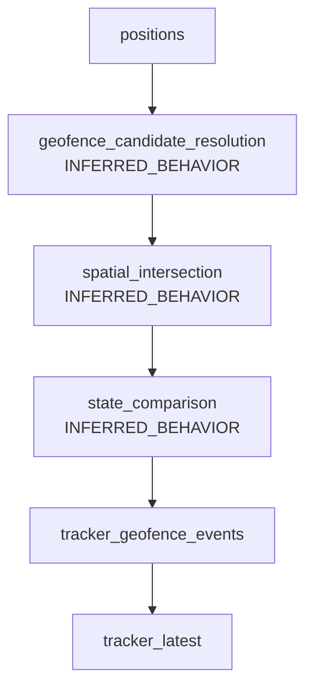

# GEOFENCE EVALUATION MODEL

## 1. Purpose

This document describes the conceptual model used to detect geofence events from GPS positions in App Geocercas.

It focuses on:

- spatial evaluation
- event generation
- assignment context
- interaction with the tracking pipeline

Scope notes:

- This is documentation-only.
- `docs/DB_SCHEMA_MAP.md` is authoritative.
- Non-explicit runtime behavior is labeled `INFERRED_BEHAVIOR`.

## 2. Geofence Domain Overview

The geofence domain is represented by:

- `geofences` (canonical model for modern tracking/dashboard flows)
- `geocercas` (legacy/compatibility model still present in the architecture)

Geofences represent spatial zones used to detect operational transitions (for example, entry and exit).

Transition note:

- both `geofences` and `geocercas` may coexist during migration/compatibility periods.

## 3. Inputs to Geofence Evaluation

### Position Records

Table:

- `positions`

Each position record is a GPS sample and includes documented fields such as:

- latitude/longitude (`lat`, `lng`)
- timestamp (`recorded_at`)
- contextual keys (`org_id`, `user_id`, `personal_id`, `asignacion_id`)

Positions are the primary trigger for geofence evaluation.

### Assignment Context

Tables:

- `asignaciones`
- `activities`
- `personal`

Assignments may provide operational context for evaluation, such as:

- which geofence is relevant to an operation
- which activity is active
- which person is responsible

Exact precedence/resolution rules are not explicitly documented and are `INFERRED_BEHAVIOR`.

### Geofence Definitions

Primary table:

- `geofences`

Legacy compatibility:

- `geocercas`

Each geofence definition supplies a spatial boundary used during evaluation.

## 4. High-Level Geofence Evaluation Flow

Conceptual pipeline:

position received  
-> candidate geofences resolved  
-> spatial intersection test  
-> previous state comparison  
-> event generation  
-> event persistence

Documentation boundary:

- the sequence above is architecture-level and partially `INFERRED_BEHAVIOR` for runtime internals.
- schema confirms participating data structures, not every processing step implementation.

## 5. Spatial Evaluation Concept

Geofence detection conceptually requires determining whether a position is:

- inside a geofence boundary
- outside a geofence boundary

A point-in-zone style check is conceptually expected for this domain.

`INFERRED_BEHAVIOR`:

- exact GIS function/library/path is not explicitly documented in the source-of-truth documents.
- exact handling of polygon/radius edge cases is not explicitly documented.

## 6. Event Detection Model

Documented event model includes transition events in `tracker_geofence_events`:

- `ENTER`
- `EXIT`

Conceptual transition rules (`INFERRED_BEHAVIOR`):

- first inside detection after outside/no-state -> `ENTRY`
- outside detection after inside-state -> `EXIT`

Possible additional semantics:

- `PRESENCE`/`DWELL` are not explicitly documented in `DB_SCHEMA_MAP.md`; treat as `INFERRED_BEHAVIOR` if present elsewhere.

## 7. State Comparison Logic

Event generation typically depends on comparing:

- current computed state (inside/outside)
- previous known state

Possible state sources in this architecture:

- `tracker_latest`
- prior records in `tracker_geofence_events`

`INFERRED_BEHAVIOR`:

- exact state source priority and comparison algorithm are not explicitly documented.

## 8. Event Persistence

Event persistence table:

- `tracker_geofence_events`

Documented role:

- stores detected geofence transitions with tenant and actor context.

Documented fields include:

- `org_id`, `user_id`, `personal_id`
- `geocerca_id`, `geocerca_nombre`, `event_type`
- `lat`, `lng`, `source`, `created_at`

Documented relationship:

- `tracker_geofence_events.geocerca_id -> geofences.id`

Naming note:

- `geocerca_id` references canonical `geofences.id`, reflecting legacy/canonical naming overlap.

## 9. Overlapping Geofence Scenarios

Possible scenarios:

- overlapping geofences
- nested zones
- a single position matching multiple zones simultaneously

`INFERRED_BEHAVIOR`:

- conflict-resolution strategy (single winner vs multi-event) is not explicitly documented.
- prioritization rules by geofence type/activity/assignment are not explicitly documented.

## 10. Event Duplication Risks

Common conceptual duplication/inconsistency risks:

- rapid GPS updates around boundaries
- GPS jitter causing repeated inside/outside flips
- reconnect/resend behavior replaying nearby positions
- overlapping geofences producing parallel transitions

Why deduplication matters:

- reduces false operational signals
- preserves event timeline quality
- improves downstream dashboards/reports

`INFERRED_BEHAVIOR`:

- exact dedup strategy and idempotency keys are not explicitly documented.

## 11. Geofence Evaluation Diagram

## 12. Architectural Observations

Key observations from the documented model:

- evaluation is event-driven from incoming position records
- assignment context is part of the operational model (`tracker_assignments`, `asignaciones`, `activities`, `personal`)
- canonical geofence model (`geofences`) coexists with legacy compatibility (`geocercas`)
- geofence evaluation is integrated into the broader tracking pipeline (`positions` -> `tracker_geofence_events` -> operational visibility structures)

## 13. Documentation Gaps

Areas currently underdocumented:

- exact spatial algorithm and geometry evaluation rules
- explicit deduplication/idempotency strategy for repeated transitions
- authoritative assignment-resolution precedence at event time
- overlap handling policy for multi-geofence matches
- exact update mechanics linking event persistence and latest-state structures

## 14. Future Improvements

Recommended documentation improvements only:

- document canonical geofence geometry formats and validation expectations
- document explicit evaluation triggers (ingest points, replay paths, manual recalculation if applicable)
- document event deduplication policy and boundary-jitter handling
- document assignment precedence and fallback logic
- document expected processing latency/SLO for event availability in monitoring views
