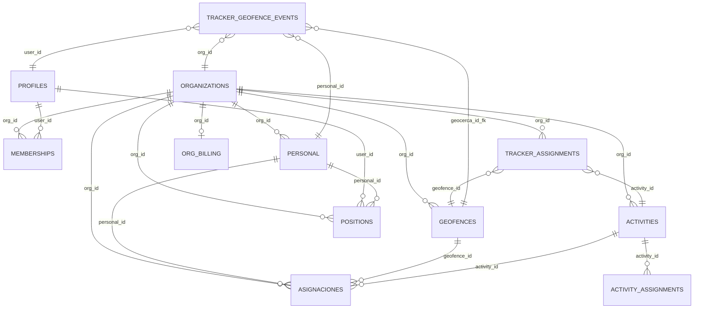
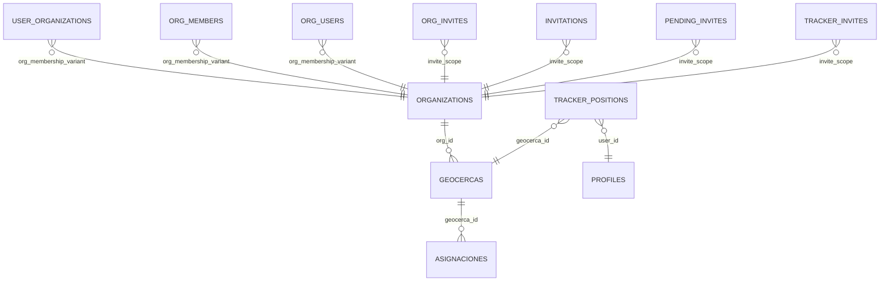

# Table Relation Diagram

Documentation-only relationship map for `geocercas-app` (Supabase/PostgreSQL).

Source of truth:

- `docs/DB_SCHEMA_MAP.md`

## Relationship Types

`FK_CONFIRMED`

Explicit foreign key documented in `DB_SCHEMA_MAP.md`.

`LOGICAL_NON_FK`

Logical/domain relationship inferred from documented columns (for example `org_id`, `personal_id`, `user_id`).

`LEGACY_LOGICAL`

Relationship belonging to legacy or compatibility tables.

`UNVERIFIED`

Relationship that may exist logically but is not documented clearly in `DB_SCHEMA_MAP.md`.

## Canonical Model

## Legacy / Compatibility Model

## Confirmed Foreign Keys

Currently documented as explicit FK in `DB_SCHEMA_MAP.md`:

- `tracker_geofence_events.geocerca_id -> geofences.id` (`FK_CONFIRMED`)

No additional FK is listed here unless explicitly documented as FK in `DB_SCHEMA_MAP.md`.

## Logical Relationships (Non-FK)

The following are represented as `LOGICAL_NON_FK` in this document:

- `organizations -> memberships` (`memberships.org_id`)
- `organizations -> personal` (`personal.org_id`)
- `organizations -> geofences` (`geofences.org_id`)
- `organizations -> asignaciones` (`asignaciones.org_id`)
- `organizations -> activities` (`activities.org_id`)
- `organizations -> positions` (`positions.org_id`)
- `organizations -> tracker_assignments` (`tracker_assignments.org_id`)
- `organizations -> org_billing` (logical key by `org_id`)
- `profiles -> memberships` (`memberships.user_id`)
- `profiles -> positions` (`positions.user_id`)
- `personal -> asignaciones` (`asignaciones.personal_id`)
- `personal -> positions` (`positions.personal_id`)
- `geofences -> asignaciones` (`asignaciones.geofence_id`)
- `activities -> asignaciones` (`asignaciones.activity_id`)
- `activities -> activity_assignments` (`activity_assignments.activity_id`)
- `tracker_assignments -> geofences` (`tracker_assignments.geofence_id`)
- `tracker_assignments -> activities` (`tracker_assignments.activity_id`)
- `tracker_geofence_events -> organizations` (`tracker_geofence_events.org_id`)
- `tracker_geofence_events -> profiles` (`tracker_geofence_events.user_id`)
- `tracker_geofence_events -> personal` (`tracker_geofence_events.personal_id`)

## Unverified Relationships

These relationships appeared in prior versions but are not clearly documented in `DB_SCHEMA_MAP.md` as structural links and are therefore downgraded to `UNVERIFIED`:

- `profiles -> tracker_assignments`
- `profiles -> activity_assignments`
- `tracker_logs -> organizations`
- `tracker_latest -> organizations`
- `attendances -> organizations`
- `asistencias -> organizations`
- `attendance_events -> organizations`

## Architecture Notes

- Multi-tenant boundary is represented primarily by `org_id`.
- Canonical and legacy models are intentionally separated.
- Key transitions documented in architecture:
  - `geocercas -> geofences`
  - `tracker_positions -> positions`
  - `tenant_id -> org_id`

## RLS Notes (Documentation Only)

RLS is intentionally described as security behavior only and is not represented as a structural relationship in diagrams.
