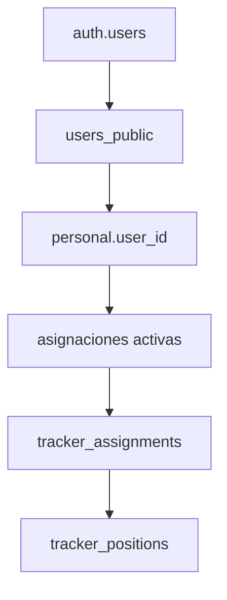

# TRACKER CURRENT SOURCE OF TRUTH

**Proyecto:** Geocercas App  
**Ambiente válido:** Preview only  
**Última actualización:** Abril 2026

---

## 1. Objetivo de este documento

Este documento define la arquitectura **vigente y obligatoria** del flujo tracker Android.

Su propósito es evitar confusión entre implementaciones legacy, docs intermedios y flujos ya descartados.

Este archivo es la **fuente única de verdad** para el tracking tracker en Android.

---

## 2. Reglas obligatorias

### Ambiente
- Solo trabajamos en **preview**
- No mezclar preview con producción
- No hacer push a `main`
- No usar producción salvo orden explícita

### Flujo tracker
- El consentimiento se resuelve en `TrackerInviteStart`
- No aceptar invite en `TrackerGpsPage`
- El backend de aceptación debe seguir siendo idempotente
- La sesión runtime debe ser consistente y reemplazarse de forma fuerte cuando llegue bootstrap nuevo

### Android
- El servicio válido para tracking persistente es **`ForegroundLocationService`**
- **No usar `TrackingService`** como servicio principal actual
- El deep link válido es `https://preview.tugeocercas.com/tracker-accept`
- **No usar `intent://`**
- El token válido para tracking es el runtime token del tracker
- No usar fallback a tokens legacy, owner tokens ni auth tokens viejos

---

## 3. Arquitectura vigente: cadena de verdad tracker (2026-05-01)

El flujo y la fuente de verdad para trackers es la siguiente:

1. **auth.users**: Usuario autenticado en Supabase Auth.
2. **users_public**: Sincronización pública y canónica del usuario, con rol `tracker` si corresponde.
3. **personal.user_id**: Identidad canónica del tracker en la organización. Si es null, el flujo se detiene.
4. **asignaciones**: Asignaciones visuales y de negocio. Solo operativas, no usadas directamente en runtime.
5. **tracker_assignments**: Espejo runtime de asignaciones activas, sincronizado automáticamente tras enlazar `personal.user_id`.
6. **tracker_positions**: Única fuente canónica de posiciones para dashboard y reportes.

### Diagrama de flujo

- El dashboard y los reportes solo deben consultar tracker_positions.
- No se debe usar owner_id ni userId del query/body en ningún punto del flujo.
- Si personal.user_id es null, el tracker no puede operar.

---

## 4. Flujo correcto end-to-end

### Paso 1. Email / invitación
El usuario recibe una invitación tracker con link absoluto en preview.

Formato válido:

`https://preview.tugeocercas.com/tracker-accept?...`

Este link debe abrir el flujo de consentimiento.

---

### Paso 2. Entrada a Android
Android captura el link por `intent-filter` configurado en `AndroidManifest.xml`.

La actividad de entrada es:

- `WebViewActivity`

La app **no depende de `intent://`** para abrir el flujo tracker.

---

### Paso 3. Consentimiento
La pantalla web `TrackerInviteStart` realiza:

- lectura del invite token
- aceptación del consentimiento
- intento de permisos de ubicación
- llamada a `/api/accept-tracker-invite`
- persistencia de `tracker_runtime_token`
- navegación posterior

El consentimiento **siempre** vive en esta etapa.

---

### Paso 4. Bootstrap nativo
`WebViewActivity` procesa el deep link tracker y hace bootstrap de sesión.

Responsabilidades:
- capturar token desde URL
- capturar `org_id`
- resolver `tracker_user_id`
- persistir sesión
- inyectar sesión al WebView
- decidir cuándo liberar `/tracker-gps`
- auto iniciar tracking si ya hay permisos

---

### Paso 5. AndroidBridge
`AndroidBridge` es el puente entre el frontend y Android nativo.

Responsabilidades:
- actualizar sesión tracker
- validar reemplazo de token
- iniciar `ForegroundLocationService`
- detener tracking cuando corresponda
- exponer estado de permisos
- abrir settings del sistema cuando sea necesario

---

### Paso 6. Tracking persistente
`ForegroundLocationService` es el servicio canónico de tracking.

Responsabilidades:
- correr como foreground service
- solicitar actualizaciones de ubicación
- mantener `wakeLock`
- reintentar envíos
- manejar cola offline
- deduplicar posiciones
- validar integridad del token
- enviar a `/api/send-position`
- recuperarse si las actualizaciones quedan stale
- reiniciar tras reboot o package replace vía `BootReceiver`

---

## 5. Servicio válido y servicio legacy

### Servicio vigente
**Válido y obligatorio:**
- `ForegroundLocationService.kt`

### Servicio legacy
**No usar como implementación actual:**
- `TrackingService.kt`

`TrackingService.kt` queda solo como referencia legacy hasta completar limpieza total del repo/docs.

No debe ser la base de nuevas correcciones ni de nueva arquitectura.

---

## 6. Regla canónica de token

La única fuente válida de token para tracking es:

- `runtimeAccessToken`
- `tracker_prefs.access_token`

Queda prohibido usar fallback a:
- `auth_token`
- `owner_token`
- `tracker_token` legacy
- `session_token`
- cualquier token no validado contra `tracker_user_id`

Regla obligatoria:
- antes de enviar posición, el JWT debe pertenecer al `tracker_user_id` esperado
- si no coincide, la sesión debe limpiarse
- si expira, la sesión debe limpiarse
- si llega un bootstrap nuevo, el token debe reemplazarse de forma fuerte

---

## 7. Deep links válidos

### Válido
- `https://preview.tugeocercas.com/tracker-accept`
- `https://preview.tugeocercas.com/tracker-gps`

### No válido para la arquitectura actual
- `intent://...`
- cualquier esquema custom no documentado ni soportado oficialmente
- navegación forzada basada en Chrome como solución principal

Chrome puede usarse como fallback UX temporal en web, pero no es la solución arquitectónica principal.

La solución principal es abrir la app por App Links.

---

## 8. Permisos y UX de permisos

### En Web
La web puede quedar bloqueada si el navegador ya tiene geolocalización en estado `denied`.

En ese caso:
- no se puede reabrir el prompt por JS
- debe mostrarse UX de fallback clara
- puede mostrarse instrucción para abrir en Chrome o abrir configuración
- esto es una limitación del navegador, no del backend

### En Android app
La app debe manejar:
- `ACCESS_FINE_LOCATION`
- `ACCESS_COARSE_LOCATION`
- `ACCESS_BACKGROUND_LOCATION` cuando aplique
- `POST_NOTIFICATIONS` en Android recientes
- foreground service location

El tracking real y persistente depende del flujo Android, no del navegador embebido.

---

## 9. Endpoint vigente de posiciones

El servicio vigente envía posiciones a:

- `https://preview.tugeocercas.com/api/send-position`

Este es el flujo válido para preview.

No introducir endpoints paralelos sin documentarlos y validar su rol en la arquitectura actual.

---

## 10. Persistencia y resiliencia obligatoria

La arquitectura tracker actual debe conservar estas propiedades:

- foreground service persistente
- wake lock
- cola de posiciones pendientes
- retry con backoff
- dedupe de posiciones
- validación fuerte del JWT
- reinicio del servicio tras reboot
- recuperación si location updates quedan stale
- tracking aunque la app quede en segundo plano

Estas capacidades pertenecen a `ForegroundLocationService`.

---

## 11. Entry points válidos

### Válidos
- `TrackerInviteStart` para consentimiento
- `WebViewActivity` para bootstrap y deep link handling
- `AndroidBridge` para puente con nativo
- `ForegroundLocationService` para tracking

### No válidos
- aceptar invite en `TrackerGpsPage`
- depender de estado manual en DB para arrancar tracking
- depender de `intent://`
- usar `TrackingService` como servicio principal vigente

---

## 12. Source of truth por componente

### Consentimiento e invite acceptance
- `TrackerInviteStart`
- `/api/accept-tracker-invite`

### Bootstrap Android
- `WebViewActivity.java`

### Puente nativo
- `AndroidBridge.java`

### Tracking persistente
- `ForegroundLocationService.kt`

### Reinicio por sistema
- `BootReceiver.kt`

### App links
- `AndroidManifest.xml`

---

## 13. Qué queda deprecado

Queda deprecado todo doc, flujo o parche que dependa de:

- `TrackingService` como arquitectura principal
- `intent://`
- token refresh flow legacy como fuente principal
- session bootstrap viejo no alineado al runtime tracker token actual
- dualidad de servicios sin source of truth claro

Todos esos materiales deben vivir en `docs/_deprecated/`.

---

## 14. Regla operativa para cambios futuros

Cada vez que se altere la arquitectura tracker se debe actualizar:

- este archivo
- los docs específicos afectados
- cualquier documento backend/architecture relacionado

No hacer cambios estructurales sin dejar explícito:
- qué archivo es la nueva fuente de verdad
- qué componente queda deprecado
- qué flujo queda prohibido

---

## 15. Estado actual resumido

### Ya resuelto
- invitación enviada correctamente
- link absoluto funcionando
- `TrackerInviteStart` abre
- aceptación del invite funciona
- backend idempotente
- runtime session se guarda
- `TrackerGpsPage` arranca
- base Android nativa existe
- `ForegroundLocationService` existe y es funcional
- app links `https://preview.tugeocercas.com/...` están configurados

### Bloque actual real
- UX de permisos web en navegadores embebidos
- handoff limpio entre email / browser / app
- consolidación final de docs y eliminación de referencias legacy

---

## 16. Decisión arquitectónica actual

La decisión vigente del proyecto es:

**El tracking serio tipo Uber en Android debe apoyarse en la app Android nativa y en `ForegroundLocationService`, no en el navegador.**

La web sirve para:
- invite
- consentimiento
- bootstrap
- continuidad inicial del flujo

La persistencia real del tracking pertenece a Android nativo.

---

## 17. Checklist de validación para cualquier cambio nuevo

Antes de aprobar un cambio tracker, validar:

- ¿Sigue usando `ForegroundLocationService`?
- ¿Evita `intent://`?
- ¿Mantiene `tracker-accept` como entrada válida?
- ¿No mueve aceptación a `TrackerGpsPage`?
- ¿Respeta preview only?
- ¿Mantiene backend idempotente?
- ¿Mantiene token runtime como única fuente válida?
- ¿No reintroduce `TrackingService` como flujo principal?
- ¿Actualiza docs?

Si alguna respuesta es no, el cambio debe revisarse antes de continuar.

---

## 5. Renderizado de rutas en TrackerDashboard

- El dashboard muestra dos tipos de datos principales:
  - **positions**: contiene los últimos marcadores (latest positions) de cada tracker, usados para mostrar la ubicación actual de cada uno.
  - **routePositions**: contiene el historial de posiciones de `tracker_positions` (no deduplicado por usuario), usado para renderizar polilíneas de rutas históricas en el mapa.
- No implica cambios en la base de datos, API ni Android; es solo lógica de frontend y visualización.
- El estado `routePositions` permite mostrar la trayectoria recorrida por cada tracker, mientras que `positions` muestra solo la última posición conocida.